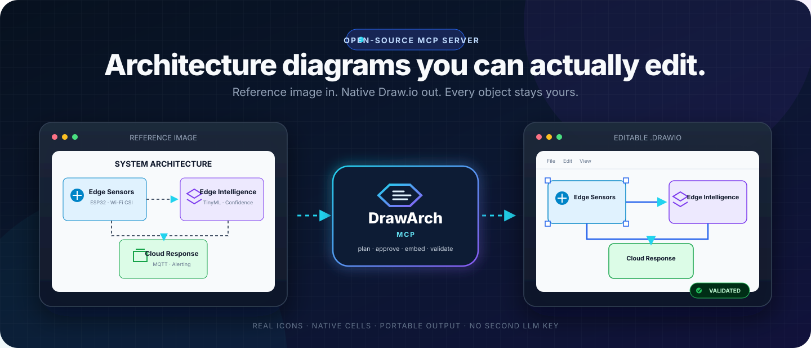
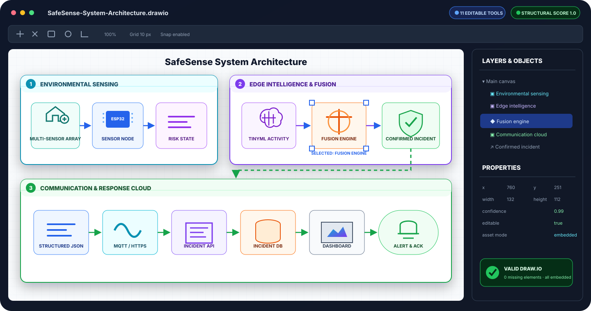
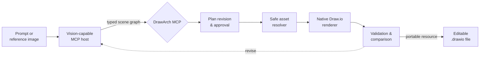

<p align="center">
  
</p>

<h1 align="center">DrawArch MCP</h1>

<p align="center">
  <strong>Turn architecture prompts and reference images into portable, natively editable Draw.io files.</strong>
  <br />
  Your MCP host does the visual reasoning. DrawArch does the deterministic rendering, asset embedding, validation, and delivery.
</p>

<p align="center">
  <a href="https://github.com/Ajey95/drawarch-mcp/actions/workflows/ci.yml"></a>
  <a href="https://github.com/Ajey95/drawarch-mcp/releases/tag/v0.2.0"></a>
  <a href="https://github.com/Ajey95/drawarch-mcp/pkgs/container/drawarch-mcp"></a>
  
  
  <a href="LICENSE"></a>
</p>

<p align="center">
  <a href="#quick-start"><strong>Quick start</strong></a> ·
  <a href="#reference-image-recreation"><strong>See the workflow</strong></a> ·
  <a href="docs/ARCHITECTURE.md"><strong>Architecture</strong></a> ·
  <a href="CONTRIBUTING.md"><strong>Contribute</strong></a>
</p>

---

## See what stays editable

<p align="center">
  
</p>

This is not a screenshot pasted into a diagram. Containers, labels, icons, shapes, connector endpoints, ports, and waypoints remain separate native `mxCell` objects. Assets are embedded inside the `.drawio` file, so the result remains portable and editable offline.

> [!IMPORTANT]
> DrawArch does not call another LLM and does not require a second LLM API key. ChatGPT, Claude, Codex, Cursor, or another vision-capable MCP host analyzes the request or image and supplies the scene graph.

## What DrawArch gives you

| | Capability | What it means |
|---|---|---|
| 🧩 | Native editability | Move, restyle, relabel, reconnect, or delete individual objects in diagrams.net. |
| 🎯 | Reference recreation | Rebuild an attached architecture image with absolute geometry, layers, z-order, ports, and waypoints. |
| 🌐 | Real-world assets | Use bundled icons, Iconify-compatible icons, user images, or approved HTTPS image sources. |
| 📦 | Portable artifacts | The generated `.drawio` is returned directly through MCP with all image assets embedded. |
| 🔐 | Approval-aware rendering | Immutable plan revisions and revision-bound approval tokens prevent stale or unreviewed renders. |
| ✅ | Validation built in | Check Draw.io structure, references, asset safety, and structural coverage before accepting output. |

## Reference-image recreation

Attach an architecture image to your MCP host and ask:

> Recreate this image with DrawArch. Preserve its layout, labels, icons, grouping, and connector routing. Keep every visible object editable and use real icons where appropriate.

The host and DrawArch then follow a reviewable four-step loop:

1. **Prepare** — the host vision model calls `prepare_reference_recreation` with a typed absolute scene graph.
2. **Review and approve** — the user or host policy reviews layout and online asset sources; approval is bound to that exact revision.
3. **Create** — `create_reference_drawio` safely resolves and embeds assets, renders native cells, validates the file, and returns the `.drawio` resource.
4. **Compare and revise** — `compare_reference_recreation` measures structural coverage; the host adjusts the plan and repeats when needed.



In plain terms: your existing AI analyzes the image; DrawArch turns that analysis into a controlled, validated, editable file. The complete contract is demonstrated in [`examples/reference-recreation.json`](examples/reference-recreation.json).

## Why not just generate an image?

| Requirement | DrawArch | Flat image generation |
|---|:---:|:---:|
| Edit individual components | ✅ | ❌ |
| Reattach and reroute connectors | ✅ | ❌ |
| Preserve explicit IDs and hierarchy | ✅ | ❌ |
| Work offline after generation | ✅ | Usually |
| Validate structure automatically | ✅ | ❌ |
| Recreate with real embedded icons | ✅ | Inconsistent |
| Iterate through a reviewable plan | ✅ | ❌ |
| Guarantee pixel-identical output | No — host-guided iteration | No |

DrawArch optimizes for **high-fidelity, editable reconstruction**, not an opaque pixel replica. The host vision model can inspect the result, update geometry or styling, and render another immutable revision.

## Quick start

Requires [Node.js 20+](https://nodejs.org/) or Docker.

### Install the GitHub release

The npm listing is not published yet. Install the verified `0.2.0` GitHub release tarball today:

```bash
npm install --global https://github.com/Ajey95/drawarch-mcp/releases/download/v0.2.0/drawarch-mcp-0.2.0.tgz
drawarch-mcp
```

DrawArch uses stdio by default. Diagnostics go to stderr, preserving stdout for MCP messages.

### Add it to a local MCP host

```json
{
  "mcpServers": {
    "drawarch": {
      "command": "drawarch-mcp",
      "env": {
        "DRAWARCH_OUTPUT_DIR": "/absolute/path/to/diagrams",
        "DRAWARCH_ONLINE_ASSETS": "false"
      }
    }
  }
}
```

If your host cannot locate global npm executables, use the [source checkout](#run-from-source) and configure an absolute `dist/src/index.js` path.

### Run from source

```bash
git clone https://github.com/Ajey95/drawarch-mcp.git
cd drawarch-mcp
npm ci
npm test
npm run build
```

Then configure your host:

```json
{
  "mcpServers": {
    "drawarch": {
      "command": "node",
      "args": ["/absolute/path/to/drawarch-mcp/dist/src/index.js"],
      "env": {
        "DRAWARCH_OUTPUT_DIR": "/absolute/path/to/diagrams"
      }
    }
  }
}
```

### Run the published container

```bash
docker run --rm -p 3000:3000 \
  -e DRAWARCH_API_KEY=replace-with-a-long-random-secret \
  -e DRAWARCH_APPROVAL_SECRET=replace-with-another-random-secret \
  -e DRAWARCH_ALLOWED_HOSTS=localhost,127.0.0.1 \
  -e DRAWARCH_ALLOWED_ORIGINS=localhost,127.0.0.1 \
  -v drawarch-data:/data \
  ghcr.io/ajey95/drawarch-mcp:0.2.0
```

The container runs Streamable HTTP on `http://localhost:3000/mcp`. Its public health probe is `GET /health`; MCP and file downloads require the configured bearer token.

## Local and remote hosts

| Host type | Recommended transport | Notes |
|---|---|---|
| Claude Desktop / Claude Code | stdio or remote HTTP | Local stdio is simplest; remote connectors can use `/mcp`. |
| Codex / Cursor / VS Code | stdio or remote HTTP | Use local stdio for per-developer output or a shared authenticated service. |
| ChatGPT | remote Streamable HTTP | ChatGPT cannot spawn the local stdio process; deploy the container behind HTTPS first. |
| CI and team services | Streamable HTTP | Set bearer auth, stable approval secret, exact host/origin allowlists, TLS, and a persistent output volume. |

DrawArch currently provides the deployable server and public container, not a managed hosted endpoint. Operators supply the HTTPS domain and infrastructure.

## MCP tools

### Architecture generation

| Tool | Purpose |
|---|---|
| `list_themes` | List six built-in visual themes. |
| `list_assets` | Search the bundled real-world icon catalog. |
| `resolve_asset` | Resolve a bundled or opt-in online SVG with provenance. |
| `create_drawio` | Generate a deterministic themed architecture diagram. |
| `validate_drawio` | Validate a generated architecture file. |

### Reference recreation

| Tool | Purpose |
|---|---|
| `prepare_reference_recreation` | Store an absolute editable scene graph and optionally approve its sources. |
| `update_reference_plan` | Create an immutable next revision and invalidate earlier approvals. |
| `get_reference_plan` | Read the latest scene-graph revision for review. |
| `create_reference_drawio` | Render an approved plan and return the portable `.drawio` artifact. |
| `validate_reference_drawio` | Validate native structure, references, and embedded-image safety. |
| `compare_reference_recreation` | Score structural coverage and report missing editable elements. |

## Asset and security model

Reference plans support four asset modes:

| Mode | Source | Server opt-in required? |
|---|---|:---:|
| `bundled` | Original MIT-licensed DrawArch SVG catalog | No |
| `online` | Iconify-compatible icon query | Yes |
| `data` | User-provided SVG, PNG, JPEG, or WebP data URI | No |
| `remote` | Explicit approved HTTPS image URL | Yes |

Remote image handling rejects URL credentials, non-HTTPS protocols, custom ports, private or reserved DNS answers, unsafe redirects, excessive byte/pixel sizes, and active SVG content. Raster images are decoded and re-encoded before embedding. Online assets retain provider and license metadata; users remain responsible for verifying third-party license terms.

HTTP deployments additionally support bearer authentication, host validation, origin validation, safe output paths, atomic writes, and revision-bound HMAC approval tokens. See [`SECURITY.md`](SECURITY.md) for deployment guidance and vulnerability reporting.

<details>
<summary><strong>Environment variables</strong></summary>

| Variable | Default | Meaning |
|---|---|---|
| `DRAWARCH_TRANSPORT` | `stdio` | Select `stdio` or `http`. |
| `DRAWARCH_OUTPUT_DIR` | `.drawarch-output` | Restricted output and plan-storage directory. |
| `DRAWARCH_ONLINE_ASSETS` | `false` | Enable opt-in online and remote image sources. |
| `DRAWARCH_ICONIFY_BASE_URL` | Iconify API | HTTPS Iconify-compatible provider base URL. |
| `HOST` | `127.0.0.1` | HTTP bind host. |
| `PORT` | `3000` | HTTP listener port. |
| `DRAWARCH_API_KEY` | unset | Bearer token for `/mcp` and `/files`; required for internet exposure. |
| `DRAWARCH_APPROVAL_SECRET` | random per process | HMAC secret for approvals; set a stable secret for shared deployments. |
| `DRAWARCH_ALLOWED_HOSTS` | local hosts | Comma-separated accepted Host values. |
| `DRAWARCH_ALLOWED_ORIGINS` | local origins | Comma-separated accepted Origin hosts. |
| `DRAWARCH_PUBLIC_BASE_URL` | listener URL | Public base URL reported by the server. |

</details>

## Development

```bash
npm ci
npm test                    # 83 tests at the 0.2.0 release
npm run build
npm run sample
npm audit --audit-level=high
npm pack --dry-run
```

The CI matrix verifies Node 20 and 22 on Windows and Linux and builds the production Docker image. Read [`docs/ARCHITECTURE.md`](docs/ARCHITECTURE.md) for component boundaries and security flow.

## Project status

| Channel | Status |
|---|---|
| Source | [Public on GitHub](https://github.com/Ajey95/drawarch-mcp) |
| Release | [`v0.2.0`](https://github.com/Ajey95/drawarch-mcp/releases/tag/v0.2.0) |
| Container | [`ghcr.io/ajey95/drawarch-mcp:0.2.0`](https://github.com/Ajey95/drawarch-mcp/pkgs/container/drawarch-mcp) |
| npm | Publication pending |
| Official MCP Registry | Metadata validated; publication follows npm release |
| Managed remote service | Not currently offered |

## Roadmap

- Expand the curated architecture asset catalog and provider metadata.
- Add preview rendering for tighter host-guided visual comparison loops.
- Add pixel-aware comparison as a complement to structural scoring.
- Publish the npm package and Official MCP Registry entry.
- Provide repeatable deployment recipes for common container platforms.

Ideas and focused pull requests are welcome. Please open an [issue](https://github.com/Ajey95/drawarch-mcp/issues) before starting a large behavior or contract change.

## Contributing

Read [`CONTRIBUTING.md`](CONTRIBUTING.md), follow the [`CODE_OF_CONDUCT.md`](CODE_OF_CONDUCT.md), and keep generated outputs, credentials, and unlicensed third-party assets out of commits.

For security concerns, follow the private reporting process in [`SECURITY.md`](SECURITY.md) rather than opening a public issue.

## License

DrawArch source code and bundled assets are available under the [MIT License](LICENSE). Third-party assets keep their original provider licenses and attribution.

---

<p align="center">
  Built for architecture work that should remain understandable, portable, and yours to edit.
</p>
